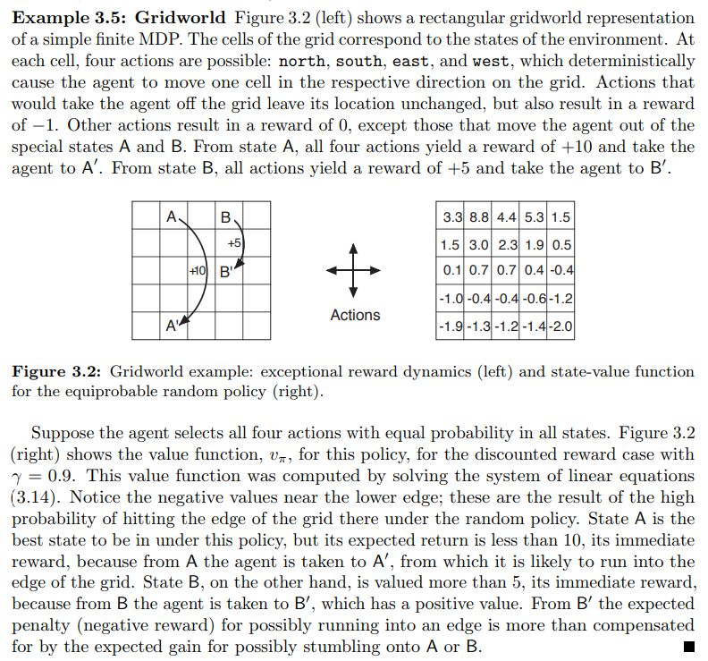
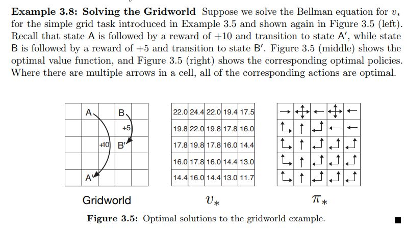
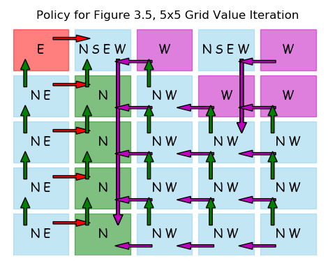
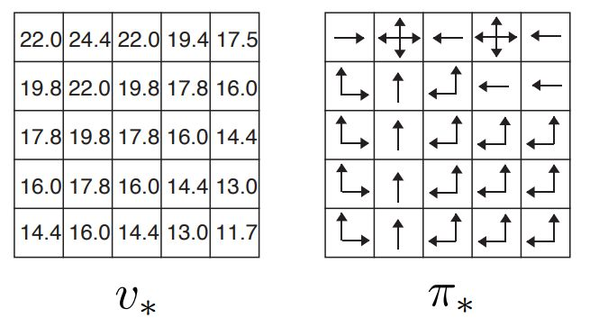

.. chapter_3

Chapter 3 Finite MDP
====================

Finite Markov Decision Processes, MDP, are introduced in this chapter.

MDPs are a mathematically idealized form of RL problems, that can be solved through the
use of a value function to help determine the optimal policy.

**IntroRL** takes some examples from this chapter just to test the Dynamic Programming methods introduced in chapter 4
that are used to estimate the value function and determine the best policy.

Example 3.5
-----------

Example 3.5 and Figure 3.2 from `Sutton & Barto <http://incompleteideas.net/book/the-book-2nd.html>`_ page 60
is shown below.

----------------

The **IntroRL** code to solve Example 3.5 is also shown below.
It uses policy evaluation methods from Dynamic Programming in chapter 4.

In policy evaluation, the policy doesn't change, but the value function is iterated under that policy until
the convergence criteria is met.

This example uses an equiprobable random policy such that each move is taken with equal probability.

.. code-block:: python
   
    from introrl.environments.env_baseline import EnvBaseline
    from introrl.dp_funcs.dp_policy_eval import dp_policy_evaluation
    from introrl.policy import Policy
    from introrl.state_values import StateValues

    from introrl.mdp_data.sutton_5x5_gridworld import get_gridworld
    gridworld = get_gridworld()
    gridworld.name = 'Figure 3.2, 5x5 Grid Policy Evaluation'

    pi = Policy( environment=gridworld )
    pi.intialize_policy_to_equiprobable( env=gridworld )

    sv = StateValues( gridworld )
    sv.init_Vs_to_zero()

    dp_policy_evaluation( pi, sv, max_iter=1000, err_delta=0.0001, gamma=0.9, fmt_V='%.1f')

The output of the above code is::

    Exited Policy Evaluation 
       iterations     = 49  (limit=1000)
       measured delta = 9.90881440277036e-06
       gamma          = 0.9
       err_delta      = 0.0001
       error limit    = 1.1111111111111108e-05
       STOP CRITERIA  = 0.11111111111111108

    ___ "Figure 3.2, 5x5 Grid Policy Evaluation" State-Value Summary ___
     === Figure 3.2, 5x5 Grid Policy Evaluation ===
           (4, 0) (4, 1) (4, 2) (4, 3) (4, 4)  ||  
           (3, 0) (3, 1) (3, 2) (3, 3) (3, 4)  ||  
           (2, 0) (2, 1) (2, 2) (2, 3) (2, 4)  ||  
           (1, 0) (1, 1) (1, 2) (1, 3) (1, 4)  ||  
           (0, 0) (0, 1) (0, 2) (0, 3) (0, 4)  ||  
     ================= State-Hash =================
         ___ Figure 3.2, 5x5 Grid Policy Evaluation State-Value Summary, V(s) ___
                                  3.3  8.8  4.4  5.3  1.5  ||  
                                  1.5  3.0  2.3  1.9  0.5  ||  
                                  0.1  0.7  0.7  0.4 -0.4  ||  
                                 -1.0 -0.4 -0.4 -0.6 -1.2  ||  
                                 -1.9 -1.3 -1.2 -1.4 -2.0  ||  

    
Example 3.8
-----------

Example 3.8 and Figure 3.5 from `Sutton & Barto <http://incompleteideas.net/book/the-book-2nd.html>`_ page 65
is shown below.

------------

Here is the **IntroRL** code to solve Example 3.8.

.. code-block:: python
   
    from introrl.dp_funcs.dp_value_iter import dp_value_iteration
    from introrl.environments.env_baseline import EnvBaseline

    from introrl.mdp_data.sutton_5x5_gridworld import get_gridworld
    gridworld = get_gridworld()
    gridworld.name = 'Figure 3.5, 5x5 Grid Value Iteration'

    policy, state_value = dp_value_iteration( gridworld, do_summ_print=True,fmt_V='%.1f',
                                              max_iter=1000, err_delta=0.001, 
                                              gamma=0.9, allow_multi_actions=True)

    policy.save_diagram( gridworld, inp_colorD=None, save_name='figure_3_5_policy',
                         show_arrows=True, scale=0.8, h_over_w=0.8, do_show=True)

The output from the above code is::

    Exited Value Iteration 
       iterations     = 46  (limit=1000)
       measured delta = 8.335248417878915e-05
       gamma          = 0.9
       err_delta      = 0.001
       error limit    = 0.00011111111111111108
       STOP CRITERIA  = 0.11111111111111108

    ___ "Figure 3.5, 5x5 Grid Value Iteration" State-Value Summary ___
     === Figure 3.5, 5x5 Grid Value Iteration ===
          (4, 0) (4, 1) (4, 2) (4, 3) (4, 4)  ||  
          (3, 0) (3, 1) (3, 2) (3, 3) (3, 4)  ||  
          (2, 0) (2, 1) (2, 2) (2, 3) (2, 4)  ||  
          (1, 0) (1, 1) (1, 2) (1, 3) (1, 4)  ||  
          (0, 0) (0, 1) (0, 2) (0, 3) (0, 4)  ||  
     ================ State-Hash ================
         ___ Figure 3.5, 5x5 Grid Value Iteration State-Value Summary, V(s) ___
                                22.0 24.4 22.0 19.4 17.5  ||  
                                19.8 22.0 19.8 17.8 16.0  ||  
                                17.8 19.8 17.8 16.0 14.4  ||  
                                16.0 17.8 16.0 14.4 13.0  ||  
                                14.4 16.0 14.4 13.0 11.7  ||  
    ___ Policy Summary ___
        Nstate-actions=25
         ___ Figure 3.5, 5x5 Grid Value Iteration Policy Summary ___
                      E (W S N E)         W (W S N E)         W  ||  
                  (N E)         N     (W N)         W         W  ||  
                  (N E)         N     (W N)     (W N)     (W N)  ||  
                  (N E)         N     (W N)     (W N)     (W N)  ||  
                  (N E)         N     (W N)     (W N)     (W N)  ||  
         _________________________ Actions _________________________
         ___ Figure 3.5, 5x5 Grid Value Iteration Reward Summary ___
              -0.666667         0      -0.5         0 -0.666667  ||  
                  -0.25         0         0         0     -0.25  ||  
                  -0.25         0         0       2.5     -0.25  ||  
                  -0.25         0         0         0     -0.25  ||  
                   -0.5     4.875     -0.25     -0.25      -0.5  ||  

