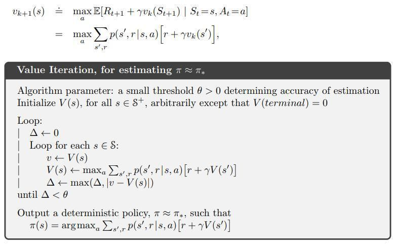

.. chapter_4

Chapter 4 DP
============

Dynamic Programming, DP, is a collection of algorithms that can be used to solve MDPs.

DP provides approaches to compute value functions, V(s).
The four major approaches are::

    (1) Policy Evaluation  - given a policy calc V(s)
    (2) Policy Improvement - given V(s) calc policy
    (3) Policy Iteration   - calc policy and V(s) by alternating (1) and (2)
    (4) Value Iteration    - calc policy and V(s) with more efficient (3)

**IntroRL** provides functions for all four of the above algorithms.

Policy Evaluation
-----------------

The approach to policy evaluation is defined in `Sutton & Barto <http://incompleteideas.net/book/the-book-2nd.html>`_ 
pages 74 and 75 as follows.

.. image:: _static/policy_evaluation_sutton.jpg

The main loop of the policy evaluation code in **IntroRL** is shown below.

.. code-block:: python

    while (loop_counter<max_iter) and (not all_done):
        loop_counter += 1
        all_done = True
        delta = 0.0 # used to calc largest change in state_value
        
        # policy evaluation 
        for s_hash in policy.iter_all_policy_states():
            
            calcd_v = 0.0
            for a_desc, a_prob in policy.iter_policy_ap_for_state( s_hash, incl_zero_prob=False):
                
                for sn_hash, t_prob, reward in \
                    Env.iter_next_state_prob_reward(s_hash, a_desc, incl_zero_prob=False):
                    
                    calcd_v += t_prob * a_prob * ( reward + gamma * state_value(sn_hash) )
            
            delta = max( delta, abs(calcd_v - state_value(s_hash)) )
            if delta > error_limit:
                all_done = False
                max_delta = max(max_delta, delta) # returned to caller
            
            state_value[s_hash] = calcd_v

`Policy Evaluation Full Souce Code <./_static/colorized_scripts/dp_funcs/dp_policy_eval.html>`_

Policy Improvement
------------------

The approach to policy evaluation is defined in `Sutton & Barto <http://incompleteideas.net/book/the-book-2nd.html>`_ 
pages 76 to 80 as follows.

It finds the greedy policy consistent with the current value function, V(s), discount factor, gamma and
the MDP behavior.

The main loop of the policy improvement code in **IntroRL** is shown below.

.. code-block:: python

    while (loop_counter<max_iter) and (not is_stable):
        loop_counter += 1
        is_stable = True
        
        # policy improvement
        for s_hash in policy.iter_all_policy_states():
            old_action = policy.get_single_action( s_hash )
            
            VsD = {} # will hold: index=a_desc, value=V(s) for all transitions of a_desc from s_hash
            for a_desc, a_prob in policy.iter_policy_ap_for_state( s_hash, incl_zero_prob=True):
                VsD[a_desc] = 0.0
                for sn_hash, t_prob, reward in \
                    Env.iter_next_state_prob_reward(s_hash, a_desc, incl_zero_prob=False):
                    
                    # need to assume that a_prob==1.0
                    #VsD[a_desc] += t_prob * a_prob * ( reward + gamma * state_value(sn_hash) )
                    VsD[a_desc] += t_prob * ( reward + gamma * state_value(sn_hash) )

            # use pick_random_best=False to avoid subtle non-termination bug (see page 82)
            best_a_desc, best_a_val = argmax_vmax_dict( VsD, pick_random_best=False )
            
            if best_a_desc != old_action:
                is_stable = False
                made_changes = True # returned to caller
            
            policy.set_sole_action( s_hash, best_a_desc)
            
`Policy Improvement Full Souce Code <./_static/colorized_scripts/dp_funcs/dp_policy_improve.html>`_

Policy Iteration
----------------

The approach to policy iteration is defined in `Sutton & Barto <http://incompleteideas.net/book/the-book-2nd.html>`_ 
pages 80 to 82 as follows.

It includes alternating between the two previous functions (policy evaluation and policy improvement)
and each of those functions must reach their own termination criteria.

The main loop of the policy iteration code in **IntroRL** is shown below.

.. code-block:: python

    while made_changes or (max_delta>err_delta):
        
        max_delta = dp_policy_evaluation( policy, state_value, do_summ_print=False,
                                          max_iter=max_iter, err_delta=err_delta, gamma=gamma)
        
        made_changes = dp_policy_improvement( policy, state_value, gamma=gamma, 
                                             do_summ_print=False, max_iter=max_iter)
                                             
`Policy Iteration Full Souce Code <./_static/colorized_scripts/dp_funcs/dp_policy_iter.html>`_

Value Iteration
---------------

The approach to value iteration is defined in `Sutton & Barto <http://incompleteideas.net/book/the-book-2nd.html>`_ 
pages 82 to 84 as follows.

It includes alternating between **truncated** versions of policy evaluation and policy improvement.
It avoids the need for those policy functions to reach their own, individual termination criteria.

The main loop of the value iteration code in **IntroRL** is shown below.

.. code-block:: python

    while (loop_counter<max_iter) and (not all_done):
        loop_counter += 1
        all_done = True
        delta = 0.0 # used to calc largest change in state_value
        
        for s_hash in policy.iter_all_policy_states():
            VsD = {} # will hold: index=a_desc, value=V(s) for all transitions of a_desc from s_hash
            
            # MUST include currently zero prob actions
            for a_desc, a_prob in policy.iter_policy_ap_for_state( s_hash, incl_zero_prob=True):
                calcd_v = 0.0
                
                for sn_hash, t_prob, reward in \
                    environment.iter_next_state_prob_reward(s_hash, a_desc, incl_zero_prob=False):
                    
                    calcd_v += t_prob * ( reward + gamma * state_value(sn_hash) )
            
                VsD[a_desc] = calcd_v
            
            best_a_desc, best_a_val = argmax_vmax_dict( VsD )
            delta = max( delta, abs(best_a_val - state_value(s_hash)) )
            state_value[s_hash] = best_a_val
            
        if delta > error_limit:
            all_done = False

`Value Iteration Full Souce Code <./_static/colorized_scripts/dp_funcs/dp_value_iter.html>`_

Example 4.1 Gridworld
---------------------

The gridworld in Example 4.1 on pages 76 and 77 of  `Sutton & Barto <http://incompleteideas.net/book/the-book-2nd.html>`_ 
is used to demonstrate the convergence of policy evaluation.

It is a small gridworld with 4 equiprobable actions and a -1 reward for every action.

The image below is a portion of figure 4.1 that shows the value function and policy that result
from applying policy evaluation repeatedly to convergence.

The code block below calls the **IntroRL** policy evaluation function to arrive at the same result.

.. code-block:: python

    from introrl.dp_funcs.dp_policy_eval import dp_policy_evaluation
    from introrl.policy import Policy
    from introrl.state_values import StateValues
    from introrl.mdp_data.sutton_ex4_1_grid import get_gridworld

    gridworld = get_gridworld()

    pi = Policy( environment=gridworld )
    pi.intialize_policy_to_equiprobable( env=gridworld )

    sv = StateValues( gridworld )
    sv.init_Vs_to_zero()

    dp_policy_evaluation( pi, sv, max_iter=1000, err_delta=0.001, gamma=1., fmt_V='%.1f')

The output from the above code is::

    Exited Policy Evaluation 
       iterations     = 167  (limit=1000)
       measured delta = 9.620565251111657e-07
       gamma          = 1.0
       err_delta      = 0.001
       error limit    = 1.0010010010010018e-06
       STOP CRITERIA  = 0.0010010010010010019

    ___ "Sutton Ex4.1 Grid World" State-Value Summary ___
     === Sutton Ex4.1 Grid World ===
                0  1  2  3  ||  
                4  5  6  7  ||  
                8  9 10 11  ||  
               12 13 14  0  ||  
     ========== State-Hash =========
         ___ Sutton Ex4.1 Grid World State-Value Summary, V(s) ___
                            0.0 -14.0 -20.0 -22.0  ||  
                          -14.0 -18.0 -20.0 -20.0  ||  
                          -20.0 -20.0 -18.0 -14.0  ||  
                          -22.0 -20.0 -14.0   0.0  ||  

Figure 4.2 Car Rental
---------------------

The Car Rental Problem on page 81 of  `Sutton & Barto <http://incompleteideas.net/book/the-book-2nd.html>`_ 
is used to demonstrate the convergence of policy iteration.

For a description of the problem, see page 81 of `Sutton & Barto <http://incompleteideas.net/book/the-book-2nd.html>`_ ,
however, the results of the policy iteration are shown below.

The code block below calls the **IntroRL** policy iteration function to arrive at the same result.

.. code-block:: python

    from introrl.dp_funcs.dp_policy_iter import dp_policy_iteration
    from introrl.policy import Policy
    from introrl.state_values import StateValues
    from introrl.mdp_data.car_rental import get_env
    
    env = get_env()

    policy = Policy( environment=env )
    policy.intialize_policy_to_random( env=env )

    state_value = StateValues( env )
    state_value.init_Vs_to_zero()

    dp_policy_iteration(policy, state_value, 
                        do_summ_print=True, show_start_policy=True,
                        max_iter=1000, err_delta=0.0001, gamma=0.9)

    diag_colorD = {'5':'r', '4':'g', '3':'b', '2':'c', '1':'y', '0':'w', 
                   '-5':'r', '-4':'g', '-3':'b', '-2':'c', '-1':'y'}
    policy.save_diagram( env, inp_colorD=diag_colorD, save_name='car_rental_var_rtn')

The policy diagram from the output of the above code is
compared to the textbook answer below.

The 3D plot of the state value from the output of the above code is
compared to the textbook 3D plot.

The 3D plot above is created by first running a script to make a data file,
`Car Rental, Make Data File Code <./_static/colorized_scripts/examples/chapter_4/dp_car_rental_PI.html>`_

And then running a script to create 
`Car Rental, 3D Plot Souce Code <./_static/colorized_scripts/examples/chapter_4/plot_car_rental_3d.html>`_

Figure 4.3 Gambler's Problem
----------------------------

The Gambler's Problem on page 84 of  `Sutton & Barto <http://incompleteideas.net/book/the-book-2nd.html>`_ 
is used to demonstrate value iteration.

For a description of the problem, see page 84 of `Sutton & Barto <http://incompleteideas.net/book/the-book-2nd.html>`_ ,
however, the results of the policy iteration are shown below.

The code block below calls the **IntroRL** value iteration function to arrive at the same result.

The answer from **IntroRL** is the full answer (i.e. referred to in the problem description).
Only the minimum bet policy is shown in the textbook answer.

Both plots are shown below.

.. code-block:: python

    from introrl.dp_funcs.dp_value_iter import dp_value_iteration
    from introrl.mdp_data.gamblers_problem import get_gambler

    gambler = get_gambler(prob_heads=0.4)

    policy, state_value = dp_value_iteration( gambler, allow_multi_actions=True,
                                              do_summ_print=True,fmt_V='%.4f',
                                              max_iter=1000, err_delta=0.00001, 
                                              gamma=1.0)
                                              

Both of the charts above are created with the  
`Gambler's Problem Run and Plot Souce Code <./_static/colorized_scripts/examples/chapter_4/dp_gamblers_problem.html>`_
