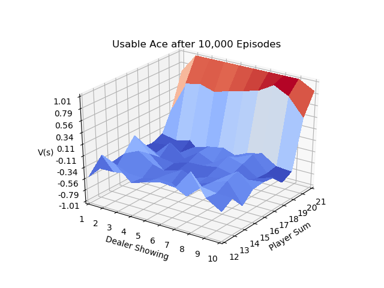
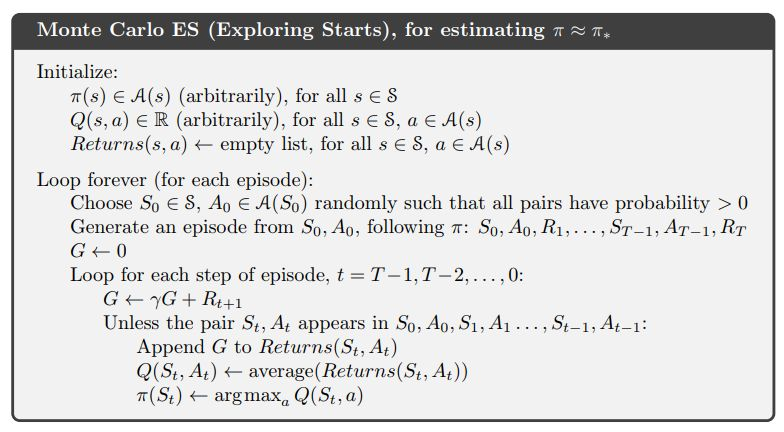

.. chapter_5

Chapter 5 Monte Carlo
=====================

Monte Carlo Methods are introduced in this chapter.

MC is able to approximate solutions to problems that do not have a full MDP model
with all of its action and transition probabilities.

**IntroRL** provides "Black Box" models that simulate a full MDP models responses.
A black box will respond to (State, Action) inputs with (Next State, Reward) responses.

First Visit MC Prediction
-------------------------

The figure below is from `Sutton & Barto <http://incompleteideas.net/book/the-book-2nd.html>`_ page 92
describing the logic behind First Visit Monte Carlo.

It is used to calculate an estimate of the value function, V(s) for a given policy.

In **IntroRL**, the main loop of the First Visit MC Prediction is shown below.

In order to assure that all start states are represented, it loops through a
randomized, full list of non-terminal states on each of the main loops.
An episode is created for each start state using the input policy and the returns
are saved to a running-average state value object.

.. code-block:: python

    while (num_episodes<=max_num_episodes-1) and keep_looping:
        
        keep_looping = False
        abserr = 0.0 # calculated below as part of termination criteria
        
        # policy evaluation 
        for start_hash in Env.iter_all_action_states( randomize=True ):
        
            # break from inner loop if max_num_episodes is hit.
            if num_episodes >= max_num_episodes:
                break
        
            make_episode(start_hash, policy, Env, Env.terminal_set, episode=episode,
                         max_steps=max_episode_steps, eps_greedy=None)
            
            num_episodes += 1
            
            for dr in episode.get_rev_discounted_returns( gamma=gamma, 
                                                          first_visit=first_visit, 
                                                          visit_type='S'):
                (s_hash, a_desc, reward, sn_hash, G) = dr
                state_value_ave.add_val( s_hash, G)
        
        abserr = state_value_ave.get_biggest_action_state_err()
        if abserr > max_abserr:
            keep_looping = True
            
        if num_episodes < min_num_episodes:
            keep_looping = True # must loop for min_num_episodes at least

`First Visit Monte Carlo Souce Code <./_static/colorized_scripts/mc_funcs/mc_fv_prediction.html>`_

Example 5.1 Blackjack
^^^^^^^^^^^^^^^^^^^^^

Page 93 of `Sutton & Barto <http://incompleteideas.net/book/the-book-2nd.html>`_ 
uses the game of blackjack to illustrate the use of First Visit MC Prediction.

The **IntroRL** code below shows the same results as example 5.1.

.. code-block:: python

    from introrl.mc_funcs.mc_fv_prediction import mc_first_visit_prediction
    from introrl.black_box_sims.blackjack_sim import BlackJackSimulation
    from introrl.policy import Policy
    from introrl.agent_supt.state_value_run_ave_coll import StateValueRunAveColl

    BJ = BlackJackSimulation()

    pi = Policy(  environment=BJ  )

    # default policy is hit on everything except 20 & 21.
    pi.set_policy_from_piD( BJ.get_default_policy_desc_dict() )

    sv = StateValueRunAveColl( BJ )

    mc_first_visit_prediction( pi, sv, max_num_episodes=10000, max_abserr=0.001, gamma=1.0)

The 3D plot above is created by first running a script to make a data file,
`Make BJ Data File Code <./_static/colorized_scripts/examples/chapter_5/mc_blackjack_eval.html>`_

And then running these scripts to create 
`3D Plot of 10,000 Episodes Souce Code <./_static/colorized_scripts/examples/chapter_5/plot_blackjack_10000_eval.html>`_
and
`3D Plot of 500,000 Episodes Souce Code <./_static/colorized_scripts/examples/chapter_5/plot_blackjack_500000_eval.html>`_

First Visit MC Exploring Starts
-------------------------------

Example 5.3: Solving Blackjack
^^^^^^^^^^^^^^^^^^^^^^^^^^^^^^

Example 5.3 in `Sutton & Barto <http://incompleteideas.net/book/the-book-2nd.html>`_ applies
Monte Carlo Exploring Starts to blackjack with the following result.

.. image:: _static/figure_5_2_sutton.jpg

Using the following code from **IntroRL**, the same policy as `Sutton & Barto <http://incompleteideas.net/book/the-book-2nd.html>`_
is obtained.

.. code-block:: python

    from introrl.mc_funcs.mc_exploring_starts import mc_exploring_starts
    from introrl.black_box_sims.blackjack_sim import BlackJackSimulation

    BJ = BlackJackSimulation()

    pi, av = mc_exploring_starts( BJ, initial_policy='default',
                                  first_visit=True, 
                                  do_summ_print=True, showRunningAve=False, fmt_Q='%g', fmt_R='%g',
                                  max_num_episodes=100000000, min_num_episodes=10, 
                                  max_abserr=0.000001, gamma=0.9,
                                  iteration_prints=0)
                                  
    pi.save_diagram( BJ, inp_colorD=None, save_name='blackjack_policy',
                     show_arrows=False, scale=0.5, h_over_w=0.8,
                     show_terminal_labels=False)

Using exploring starts with a very large number of episodes, 
**IntroRL** outputs the following results
which agree with the answer given on page 100 of 
`Sutton & Barto <http://incompleteideas.net/book/the-book-2nd.html>`_ 

    

The 3D plot above is created by first running a script to make a data file,
`Make ES Data File Code <./_static/colorized_scripts/examples/chapter_5/mc_blackjack_explore_starts.html>`_

And then running 
`3D Plot ES Souce Code <./_static/colorized_scripts/examples/chapter_5/plot_blackjack_es.html>`_

The policy is also in agreement.::

    ___ Policy Summary ___
        Nstate-actions=210
         ___ BlackJack Simulation Policy Summary ___
             *   *   *   *   *   *   *   *   *   * | Lose || U
             *   *   *   *   *   *   *   *   *   * | Draw || s
             *   *   *   *   *   *   *   *   *   * | Win  || ab
             S   S   S   S   S   S   S   S   S   S | 21   || l
             S   S   S   S   S   S   S   S   S   S | 20   || e
             S   S   S   S   S   S   S   S   S   S | 19   || A 
           Hit   S   S   S   S   S   S   S Hit Hit | 18   || ce  
           Hit Hit Hit Hit Hit Hit Hit Hit Hit Hit | 17   ||   
           Hit Hit Hit Hit Hit Hit Hit Hit Hit Hit | 16   || 
           Hit Hit Hit Hit Hit Hit Hit Hit Hit Hit | 15   || P
           Hit Hit Hit Hit Hit Hit Hit Hit Hit Hit | 14   || la
           Hit Hit Hit Hit Hit Hit Hit Hit Hit Hit | 13   || y
           Hit Hit Hit Hit Hit Hit Hit Hit Hit Hit | 12   || er 
             *   *   *   *   *   *   *   *   *   * | Lose || 
             *   *   *   *   *   *   *   *   *   * | Draw || Su
             *   *   *   *   *   *   *   *   *   * | Win  || m 
             S   S   S   S   S   S   S   S   S   S | 21   ||    
             S   S   S   S   S   S   S   S   S   S | 20   ||   
             S   S   S   S   S   S   S   S   S   S | 19   || N
             S   S   S   S   S   S   S   S   S   S | 18   || o 
             S   S   S   S   S   S   S   S   S   S | 17   || U
           Hit   S   S   S   S   S Hit Hit Hit Hit | 16   || sa
           Hit   S   S   S   S   S Hit Hit Hit Hit | 15   || b
           Hit   S   S   S   S   S Hit Hit Hit Hit | 14   || l
           Hit   S   S   S   S   S Hit Hit Hit Hit | 13   || e 
           Hit Hit Hit   S   S   S Hit Hit Hit Hit | 12   || A
           Hit Hit Hit Hit Hit Hit Hit Hit Hit Hit | 11   || ce
           _1___2___3___4___5___6___7___8___9___10__
         ______________ Dealer Showing _____________

Note that the above solution uses a gamma of 0.9.
Interestingly, when run with a gamma of 1.0, the solution is very slightly different
for the "No Usable Ace" and player sum of 12::

    ___ Policy Summary ___
        Nstate-actions=210
         ___ BlackJack Simulation Policy Summary ___
             *   *   *   *   *   *   *   *   *   * | Lose || U
             *   *   *   *   *   *   *   *   *   * | Draw || s
             *   *   *   *   *   *   *   *   *   * | Win  || ab
             S   S   S   S   S   S   S   S   S   S | 21   || l
             S   S   S   S   S   S   S   S   S   S | 20   || e 
             S   S   S   S   S   S   S   S   S   S | 19   || A
           Hit   S   S   S   S   S   S   S Hit Hit | 18   || ce
           Hit Hit Hit Hit Hit Hit Hit Hit Hit Hit | 17   ||  
           Hit Hit Hit Hit Hit Hit Hit Hit Hit Hit | 16   ||    
           Hit Hit Hit Hit Hit Hit Hit Hit Hit Hit | 15   || P
           Hit Hit Hit Hit Hit Hit Hit Hit Hit Hit | 14   || la
           Hit Hit Hit Hit Hit Hit Hit Hit Hit Hit | 13   || y
           Hit Hit Hit Hit Hit Hit Hit Hit Hit Hit | 12   || er
             *   *   *   *   *   *   *   *   *   * | Lose ||  
             *   *   *   *   *   *   *   *   *   * | Draw || Su
             *   *   *   *   *   *   *   *   *   * | Win  || m
             S   S   S   S   S   S   S   S   S   S | 21   ||   
             S   S   S   S   S   S   S   S   S   S | 20   ||   
             S   S   S   S   S   S   S   S   S   S | 19   || N
             S   S   S   S   S   S   S   S   S   S | 18   || o
             S   S   S   S   S   S   S   S   S   S | 17   || U
           Hit   S   S   S   S   S Hit Hit Hit Hit | 16   || s
           Hit   S   S   S   S   S Hit Hit Hit Hit | 15   || ab
           Hit   S   S   S   S   S Hit Hit Hit Hit | 14   || l
           Hit   S   S   S   S   S Hit Hit Hit Hit | 13   || e 
           Hit Hit Hit Hit   S   S Hit Hit Hit Hit | 12   || A
           Hit Hit Hit Hit Hit Hit Hit Hit Hit Hit | 11   || ce
           _1___2___3___4___5___6___7___8___9___10__
         ______________ Dealer Showing _____________

Also of note, the answer from
`Shangtong Zhang <https://github.com/ShangtongZhang/reinforcement-learning-an-introduction>`_
results in a 3rd answer for the "No Usable Ace" and player sum of 12.

First Visit Epsilon-Greedy MC
-----------------------------

The algorithm for an epsilon-greedy policy is given on page 101 of
`Sutton & Barto <http://incompleteideas.net/book/the-book-2nd.html>`_ 

The main loop of the implementation of epsilon-greedy Monte Carlo in **IntroRL** is shown below.

.. code-block:: python

    limited_start_stateL = environment.limited_start_state_list()
    
    while (num_episodes<=max_num_episodes-1) and keep_looping :
        
        keep_looping = False
        abserr = 0.0 # calculated below as part of termination criteria
        Nterminal_episodes = set()
        
        # Iterate over a list of known possible start states
        if use_list_of_start_states:
            loop_stateL = limited_start_stateL
            random.shuffle( loop_stateL )
        else:
            #loop_stateL = [ random.choice( limited_start_stateL ) ]
            loop_stateL = [ environment.start_state_hash ]
        
        for start_hash in loop_stateL:
            
            if iter_all_start_actions:# Iterate over ALL ACTIONS of start_hash
                a_descL = environment.get_state_legal_action_list( start_hash )
            else:
                a_desc = policy.get_single_action( start_hash )
                # if not iterating all actions, make sure first action has eps-greedy applied
                a_desc = eps_greedy( a_desc, 
                                     environment.get_state_legal_action_list( start_hash ) )
                a_descL = [ a_desc ]
            # randomize action order
            random.shuffle( a_descL )
            
            for a_desc in a_descL:
                
                # break from inner loop if max_num_episodes is hit.
                if num_episodes >= max_num_episodes:
                    break
                
                make_episode(start_hash, policy, 
                             environment, environment.terminal_set, 
                             episode=episode, first_a_desc=a_desc,
                             max_steps=max_episode_steps, eps_greedy=eps_greedy)
                eps_greedy.inc_N_episodes()
                num_episodes += 1
                
                if episode.is_done():
                    Nterminal_episodes.add( start_hash )
            
                for dr in episode.get_rev_discounted_returns( gamma=gamma, 
                                                              first_visit=first_visit, 
                                                              visit_type='SA'):
                    # look at each step from episode and calc average Q(s,a)
                    (s, a, r, sn, G) = dr
                    action_value_ave.add_val( s, a, G)
                    
                    aL = environment.get_state_legal_action_list( s )
                    if aL:
                        best_a_desc, best_a_val = aL[0], float('-inf')
                        bestL = [best_a_desc]
                        for a in aL:
                            q = action_value_ave.get_ave( s, a )
                            if q > best_a_val:
                                best_a_desc, best_a_val = a, q
                                bestL = [ a ]
                            elif q == best_a_val:
                                bestL.append( a )
                        best_a_desc = random.choice( bestL )
                        policy.set_sole_action(s, best_a_desc)
                
        abserr = action_value_ave.get_biggest_action_state_err()
        if abserr > max_abserr:
            keep_looping = True
            
        if num_episodes < min_num_episodes:
            keep_looping = True # must loop for min_num_episodes at least

`First Visit Epsilon-Greedy MC Souce Code <./_static/colorized_scripts/mc_funcs/mc_fv_epsilon_greedy.html>`_

Invoking the above code with the **IntroRL** code below, gives the correct policy and state values.

.. code-block:: python

    from introrl.mc_funcs.mc_fv_epsilon_greedy import mc_epsilon_greedy
    from introrl.black_box_sims.blackjack_sim import BlackJackSimulation

    BJ = BlackJackSimulation()

    pi, av = mc_epsilon_greedy( BJ, initial_policy='default',
                             read_pickle_file='blackjack_epsgreedy', 
                             save_pickle_file='blackjack_epsgreedy',
                             first_visit=True, 
                             do_summ_print=True, showRunningAve=False, fmt_Q='%g', fmt_R='%g',
                             show_initial_policy=True,
                             max_num_episodes=5000000, min_num_episodes=10, 
                             max_abserr=0.0001, gamma=0.9,
                             iteration_prints=0,
                             max_episode_steps=10000,
                             epsilon=0.1, const_epsilon=True)
                              
The policy from the above code is::

    ___ Policy Summary ___
        Nstate-actions=210
         ___ BlackJack Simulation Policy Summary ___
             *   *   *   *   *   *   *   *   *   * | Lose || U
             *   *   *   *   *   *   *   *   *   * | Draw || s
             *   *   *   *   *   *   *   *   *   * | Win  || ab
             S   S   S   S   S   S   S   S   S   S | 21   || l
             S   S   S   S   S   S   S   S   S   S | 20   || e 
             S   S   S   S   S   S   S   S   S   S | 19   || A
           Hit   S   S   S   S   S   S   S Hit Hit | 18   || ce
           Hit Hit Hit Hit Hit Hit Hit Hit Hit Hit | 17   ||  
           Hit Hit Hit Hit Hit Hit Hit Hit Hit Hit | 16   ||    
           Hit Hit Hit Hit Hit Hit Hit Hit Hit Hit | 15   || P
           Hit Hit Hit Hit Hit Hit Hit Hit Hit Hit | 14   || la
           Hit Hit Hit Hit Hit Hit Hit Hit Hit Hit | 13   || y
           Hit Hit Hit Hit Hit Hit Hit Hit Hit Hit | 12   || er
             *   *   *   *   *   *   *   *   *   * | Lose ||  
             *   *   *   *   *   *   *   *   *   * | Draw || Su
             *   *   *   *   *   *   *   *   *   * | Win  || m
             S   S   S   S   S   S   S   S   S   S | 21   ||   
             S   S   S   S   S   S   S   S   S   S | 20   ||   
             S   S   S   S   S   S   S   S   S   S | 19   || N
             S   S   S   S   S   S   S   S   S   S | 18   || o
             S   S   S   S   S   S   S   S   S   S | 17   || U
           Hit   S   S   S   S   S Hit Hit Hit   S | 16   || s
           Hit   S   S   S   S   S Hit Hit Hit Hit | 15   || ab
           Hit   S   S   S   S   S Hit Hit Hit Hit | 14   || l
           Hit   S   S   S   S   S Hit Hit Hit Hit | 13   || e 
           Hit Hit Hit   S   S   S Hit Hit Hit Hit | 12   || A
           Hit Hit Hit Hit Hit Hit Hit Hit Hit Hit | 11   || ce
           _1___2___3___4___5___6___7___8___9___10__
         ______________ Dealer Showing _____________

