.. chapter_6

Chapter 6 TD Learning
=====================

Temporal-Difference Learning is defined here as central to reinforcement learning.

Tabular TD(0) Prediction
------------------------

Use temporal difference to estimate the state value function of a given policy.

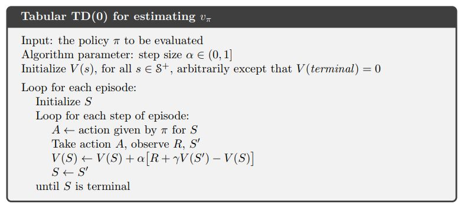

In **IntroRL**, the main loop of the TD(0) Prediction is shown below.

.. code-block:: python

    while (num_episodes<=max_num_episodes-1) and keep_looping:
        
        keep_looping = False
        abserr = 0.0 # calculated below as part of termination criteria
        
        # policy evaluation 
        for start_hash in start_stateL:
            num_episodes += 1
            if num_episodes > max_num_episodes:
                break
            
            s_hash = start_hash
            a_desc = policy.get_single_action( s_hash )
            for _ in range( max_episode_steps ):
        
                sn_hash, reward = Env.get_action_snext_reward( s_hash, a_desc )
                
                state_value_coll.td0_update( s_hash=s_hash, alpha=alpha_obj(), 
                                                         gamma=gamma, sn_hash=sn_hash, 
                                                         reward=reward)
                
                if (sn_hash in Env.terminal_set) or (sn_hash is None):
                    break
                
                # get ready for next step
                s_hash = sn_hash
                
                a_desc = policy.get_single_action( s_hash )
                if a_desc is None:
                    print('a_desc is None for policy.get_single_action( "%s" ) ='%\
                          str(s_hash), a_desc)
                
        abserr = state_value_coll.get_biggest_action_state_err()
        if abserr > max_abserr:
            keep_looping = True
            
        if num_episodes < min_num_episodes:
            keep_looping = True # must loop for min_num_episodes at least

`TD(0) Prediction Full Souce Code <./_static/colorized_scripts/td_funcs/td0_prediction.html>`_

Example 6.2 Random Walk
-----------------------

Example 6.2 in 
`Sutton & Barto <http://incompleteideas.net/book/the-book-2nd.html>`_ on page 125
uses the random walk Markov Reward Process (MRP) below.

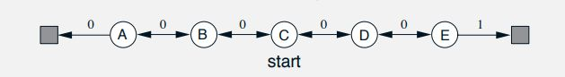

The solution from `Sutton & Barto <http://incompleteideas.net/book/the-book-2nd.html>`_ 
and from **IntroRL** are shown below.

They both show that TD(0) converges more quickly than MC for this problem.

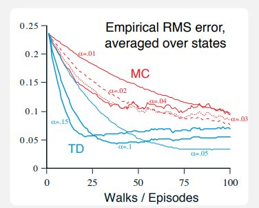

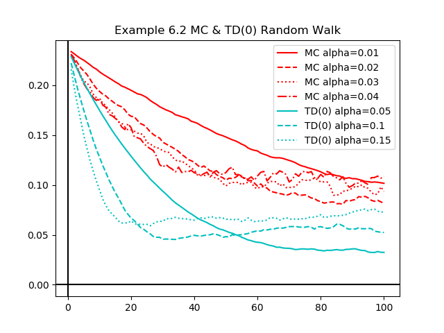

`IntroRL Example 6.2 Souce Code <./_static/colorized_scripts/examples/chapter_6/random_walk/example_6_2_random_walk.html>`_

Figure 6.2 Batch Training
-------------------------

Figure 6.2 on page 127 of `Sutton & Barto <http://incompleteideas.net/book/the-book-2nd.html>`_
shows that batch TD is consistently better than batch MC for the random walk shown above in example 6.2.

The figure on the left below is directly from
`Sutton & Barto <http://incompleteideas.net/book/the-book-2nd.html>`_

The figure on the right below is generated by **IntroRL** and overlays the results of
**IntroRL**, `Sutton & Barto <http://incompleteideas.net/book/the-book-2nd.html>`_
and `Shangtong Zhang <https://github.com/ShangtongZhang/reinforcement-learning-an-introduction>`_

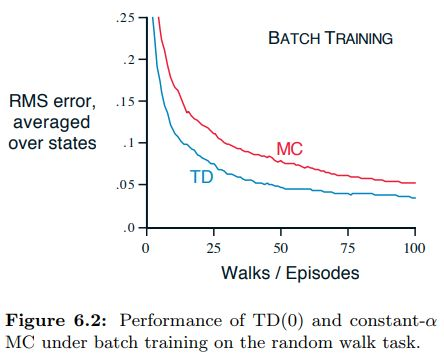

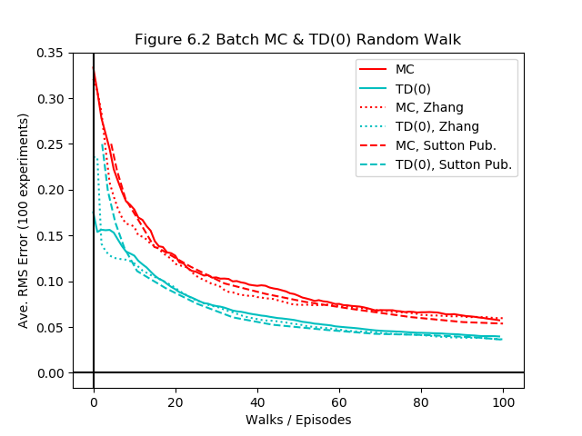

`IntroRL Figure 6.2 Souce Code <./_static/colorized_scripts/examples/chapter_6/random_walk/figure_6_2_random_walk.html>`_

Sarsa On-Policy TD Control
--------------------------

Baseline for epsilon greedy version of Sarsa.

The pseudo code of SARSA prediction of Q(s,a) is given on page 130 of
`Sutton & Barto <http://incompleteideas.net/book/the-book-2nd.html>`_
and is shown below.

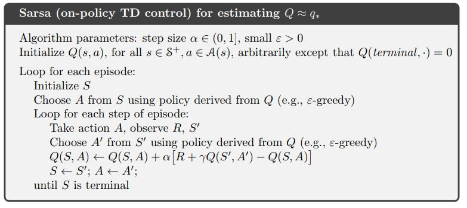

The main loop of the **IntroRL** Epsilon Greedy Sarsa control function is shown below

.. code-block:: python

    while (episode_loop_counter<=max_num_episodes-1) and keep_looping :
            
        keep_looping = False
        abserr = 0.0 # calculated below as part of termination criteria
        Nterminal_episodes = set() # tracks if start_hash got to terminal_set or max_num_episodes
        
        for start_hash in loop_stateL:
            episode_loop_counter += 1
            if episode_loop_counter > max_num_episodes:
                break
            
            if learn_tracker is not None:
                learn_tracker.add_new_episode()
            
            s_hash = start_hash
            a_desc = action_value_coll.get_best_eps_greedy_action( s_hash, epsgreedy_obj=eg )
            
            for n_episode_steps in range( max_episode_steps ):
                
                # Begin an episode
                if a_desc is None:
                    Nterminal_episodes.add( start_hash )
                    print('break for a_desc==None')
                    break
                else:
                    sn_hash, reward = environment.get_action_snext_reward( s_hash, a_desc )
                    if learn_tracker is not None:
                        learn_tracker.add_sarsn_to_current_episode( s_hash, a_desc, 
                                                                    reward, sn_hash)
                    
                    if sn_hash is None:
                        Nterminal_episodes.add( start_hash )
                        print('break for sn_hash==None')
                        break
                    else:
                        an_desc = action_value_coll.get_best_eps_greedy_action( sn_hash, 
                                                                                epsgreedy_obj=eg )
            
                        action_value_coll.sarsa_update( s_hash=s_hash, a_desc=a_desc, 
                                                        alpha=alpha_obj(), gamma=gamma, 
                                                        sn_hash=sn_hash, an_desc=an_desc, 
                                                        reward=reward)
                        
                        if sn_hash in environment.terminal_set:
                            Nterminal_episodes.add( start_hash )
                            if (n_episode_steps==0) and (num_s_hash>2):
                                print('1st step break for sn_hash in terminal_set', sn_hash, 
                                      ' s_hash=%s'%str(s_hash), ' a_desc=%s'%str(a_desc))
                            break
                        s_hash = sn_hash
                        a_desc = an_desc
        
        # increment episode counter on EpsilonGreedy and Alpha objects
        eg.inc_N_episodes()
        alpha_obj.inc_N_episodes()
                
        abserr = action_value_coll.get_biggest_action_state_err()
        if abserr > max_abserr:
            keep_looping = True
            
        if episode_loop_counter < min_num_episodes:
            keep_looping = True # must loop for min_num_episodes at least

`Sarsa On-Policy, Full Souce Code <./_static/colorized_scripts/td_funcs/sarsa_epsilon_greedy.html>`_

Example 6.5 Windy Gridworld
---------------------------

Example 6.5 applies epsilon greedy Sarsa to the Windy Gridworld

The case is run with gamma=1.0, epsilon=0.1 and alpha=0.5
`Example 6.5 Windy Gridworld, Full Souce Code <./_static/colorized_scripts/examples/chapter_6/windy_gridworld/sarsa_windy_gridworld.html>`_

Shown below on the left is the answer published in `Sutton & Barto <http://incompleteideas.net/book/the-book-2nd.html>`_

On the right is a plot comparing the results if **IntroRL**, `Sutton & Barto <http://incompleteideas.net/book/the-book-2nd.html>`_
and `Denny Britz <https://github.com/dennybritz/reinforcement-learning/blob/master/TD/SARSA%20Solution.ipynb>`_

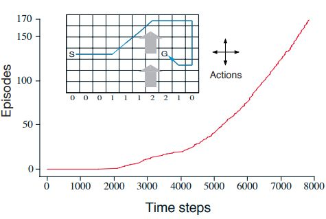

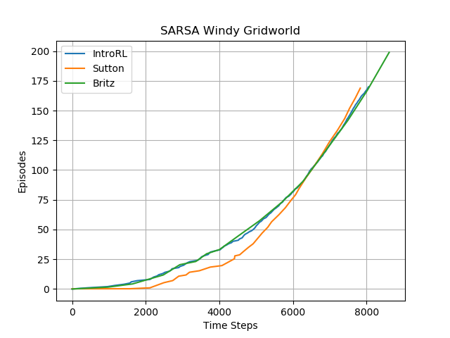

The policy from the **IntroRL** run results in the episode shown below,
however, the resulting policy was not consistent, often getting caught in infinite loops::

     _________________ Windy Gridworld Sutton Ex6.5 Episode Summary ________________
          *       *       *       *       *       *  [7->R]  [8->R]  [9->R] [10->D]  ||  
          *       *       *       *       *  [6->R]       *       *       * [11->D]  ||  
          *       *       *       *  [5->R]       *       *       *       * [12->D]  ||  
     [1->R]  [2->R]  [3->R]  [4->R]       *       *       *       *       * [13->D]  ||  
          *       *       *       *       *       *       *       * [15->L] [14->L]  ||  
          *       *       *       *       *       *       *       *       *       *  ||  
          *       *       *       *       *       *       *       *       *       *  ||  
    ___0_______0_______0_______1_______1_______1_______2_______2_______1_______0___
     ______________________________ Upward Wind Speed ______________________________

Example 6.6 Cliff Walking
-------------------------

Example 6.6 compares epsilon-greedy Q-learning to epsilon-greedy Sarsa for a Cliff Walking Gridworld.
The Q-learning pseudo code is given on page 131 of `Sutton & Barto <http://incompleteideas.net/book/the-book-2nd.html>`_

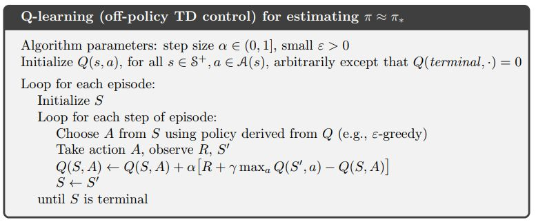

The `Example 6.6 Cliff Walking, Full Souce Code <./_static/colorized_scripts/td_funcs/qlearning_epsilon_greedy.html>`_
of the **IntroRL** Q-learning function is much like the 
`Sarsa On-Policy, Full Souce Code <./_static/colorized_scripts/td_funcs/sarsa_epsilon_greedy.html>`_
except for the update of the Q(s,a) value.

.. code-block:: python

    # Q-learning Q(s,a) update
    action_value_coll.qlearning_update( s_hash=s_hash, a_desc=a_desc, sn_hash=sn_hash,
                                        alpha=alpha_obj(), gamma=gamma, 
                                        reward=reward)

    # Sarsa Q(s,a) update
    action_value_coll.sarsa_update( s_hash=s_hash, a_desc=a_desc, 
                                    alpha=alpha_obj(), gamma=gamma, 
                                    sn_hash=sn_hash, an_desc=an_desc, 
                                    reward=reward)

The point of Example 6.6 is to show that Sarsa takes the epsilon-greedy action selection into
account and travels the safer route along the top of the grid.

Q-learning takes the more efficient route along the edge of the cliff, ignoring the exploration dangers
of epsilon-greedy.

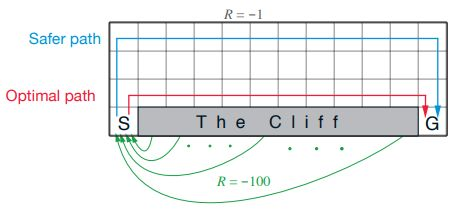

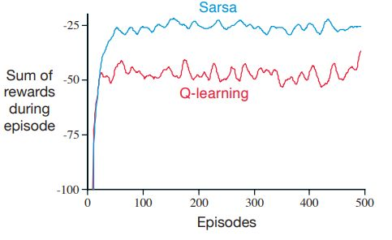

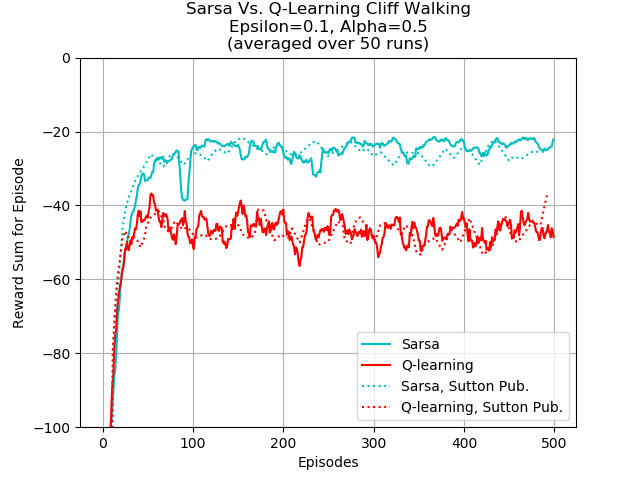

The above-right image overlays the results of
`Sutton & Barto <http://incompleteideas.net/book/the-book-2nd.html>`_ and **IntroRL**.

Figure 6.3 Expected Sarsa
-------------------------

Figure 6.3 on page 133 of `Sutton & Barto <http://incompleteideas.net/book/the-book-2nd.html>`_
illustrates the benefit of Expected Sarsa over both Sarsa and Q-learning.

The description of figure 6.3 applies to the chart on the left, below.

The chart on the right is run by **IntroRL** with fewer runs than the
`Sutton & Barto <http://incompleteideas.net/book/the-book-2nd.html>`_ chart.

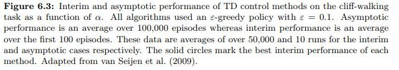

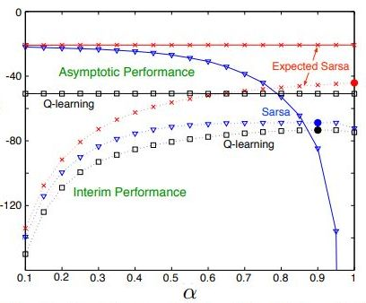

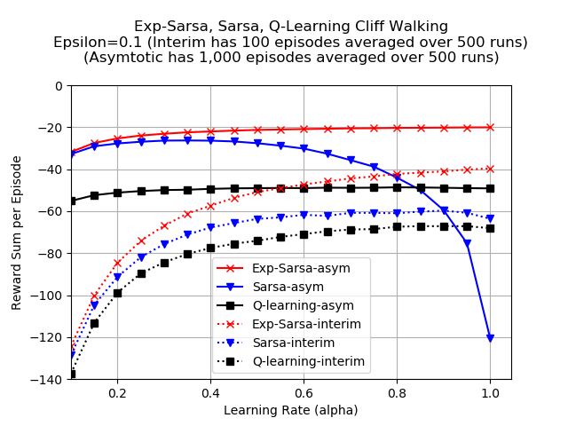

The plot above is created by first running a script to make a data file,
`Make Figure 6.3 Expected Sarsa Data File Code <./_static/colorized_scripts/examples/chapter_6/cliff_walking/build_fig_6_3_data.html>`_

And then running a script to create the plot, 
`Figure 6.3 Expected Sarsa, Plotting Souce Code <./_static/colorized_scripts/examples/chapter_6/cliff_walking/plot_fig_6_3.html>`_

Figure 6.5 Double Qlearning
---------------------------

Double Q-learning is outlined in the pseudo code below.

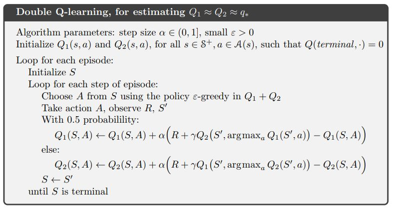

Figure 6.5 demonstrates how Double Qlearning is virtually unaffected by maximization bias.

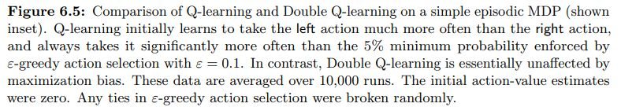

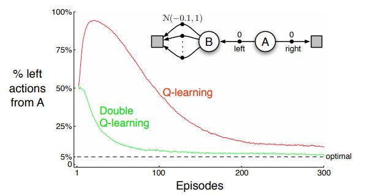

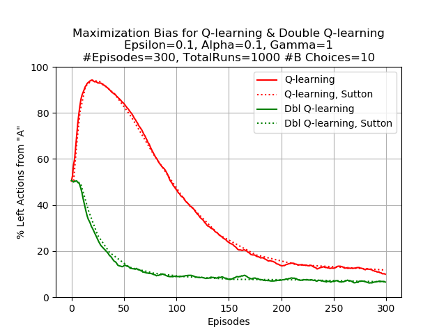

The **IntroRL** chart, above right, was run with 10 choices from **(B)** in the MDP
`Figure 6.5 Double Qlearning, Full Souce Code <./_static/colorized_scripts/examples/chapter_6/plot_fig_6_5_maximization_bias.html>`_

The **IntroRL** values are overlaid on the `Sutton & Barto <http://incompleteideas.net/book/the-book-2nd.html>`_ values.

