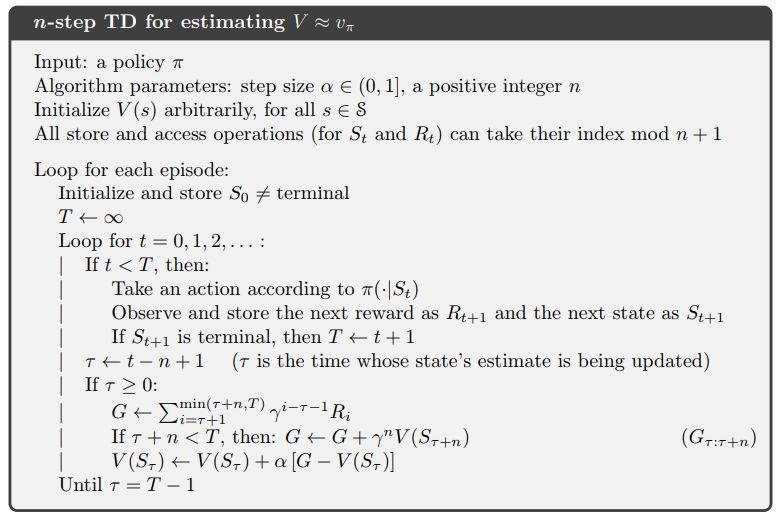
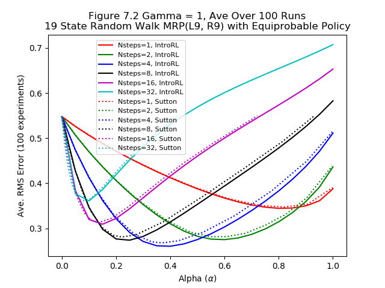
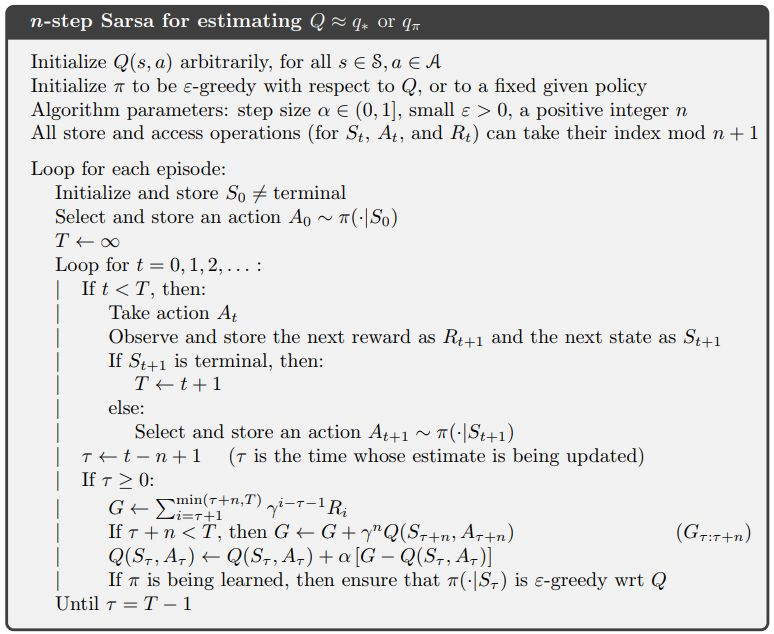

.. chapter_7

Chapter 7 n-step Bootstrapping
==============================

The pseudo code for n-step TD is shown below.

Given a policy, this algorithm will estimate the state values in the environment.

**IntroRL** implements the above pseudo code with the class
`NStepTDWalker <./_static/colorized_scripts/agent_supt/nstep_td_eval_walker.html>`_

Figure 7.2 Random Walk
----------------------

Figure 7.2 illustrates the fact that an n-step algorithm can outperform both TD(0) and 
Monte Carlo. 

For the 19 state random walk process, the image below compares the results
of the `NStepTDWalker <./_static/colorized_scripts/agent_supt/nstep_td_eval_walker.html>`_
from **IntroRL** with the published 
`Sutton & Barto <http://incompleteideas.net/book/the-book-2nd.html>`_ values.

The code used to generate the above figure is: 
`Figure 7.2 Code <./_static/colorized_scripts/examples/chapter_7/figure_7_2.html>`_

Few Examples
------------

Chapter 7 gives very few examples against which to verify **IntroRL** routines.

Perhaps of interest, however, is the use of the n-step Sarsa routine.

Using the above pseudo code, **IntroRL** implements 
`NStepSarsaWalker <./_static/colorized_scripts/agent_supt/nstep_sarsa_eval_walker.html>`_
for evaluating a policy.

Also implemented is
`NStepSarsaQStarFinder <./_static/colorized_scripts/agent_supt/nstep_sarsa_qstar_walker.html>`_
for calculating the optimum action value function ``Q*``.
