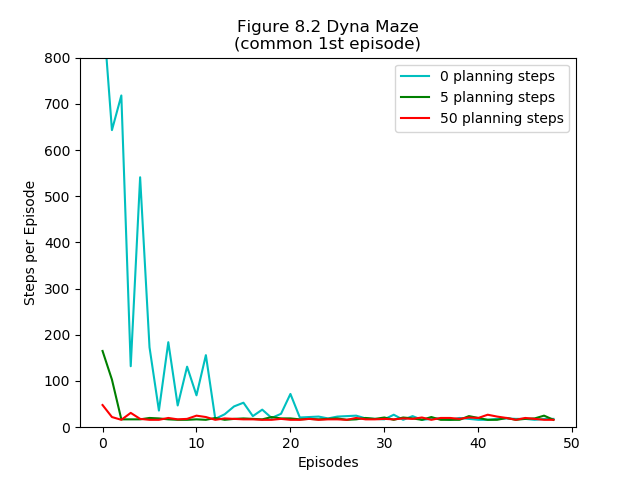

.. chapter_8

Chapter 8 Planning & Learning
=============================

Tabular DynaQ
-------------

**IntroRL** implements the above pseudo code with the class
`DynaQAgent <./_static/colorized_scripts/agents/dyna_q_agent.html>`_

Figure 8.2 DynaQ Grid
---------------------

Figure 8.2 from `Sutton & Barto <http://incompleteideas.net/book/the-book-2nd.html>`_ 
is shown below on the left.

It illustrates the difference that planning steps make in solving the grid from "S" to "G".

The figure shown above on the right is from the **IntroRL** implementation of tabular DynaQ.

The code used to generate the above figure is: 
`Figure 8.2 Code <./_static/colorized_scripts/examples/chapter_8/plot_fig_8_2.html>`_

Figure 8.4 Blocking Maze
------------------------

Figure 8.4 goes with ``Example 8.2 Blocking Maze`` on page 166 of 
`Sutton & Barto <http://incompleteideas.net/book/the-book-2nd.html>`_ .
It illustrates how the DynaQ and DynaQ+ algorithms adapt to a maze that changes configuration
as the analysis progresses.

In particular, this maze closes off the shortest route to the goal, and opens a longer route
to the goal partway through the analysis.
The figure on the lower left illustrates the two maze configurations used during the analysis.

The figure on the lower right compares the results of **IntroRL** with 
`Sutton & Barto <http://incompleteideas.net/book/the-book-2nd.html>`_ and
`Shangtong Zhang <https://github.com/ShangtongZhang/reinforcement-learning-an-introduction>`_ 

The code used to generate the above figure is: 
`Figure 8.4 Code <./_static/colorized_scripts/examples/chapter_8/plot_fig_8_4_blocking_maze.html>`_

The figure also relies on the code for 
`DynaQAgent <./_static/colorized_scripts/agents/dyna_q_agent.html>`_ and
`DynaQPlusAgent <./_static/colorized_scripts/agents/dyna_qplus_agent.html>`_

Figure 8.5 Shortcut Maze
------------------------

Figure 8.5 goes with ``Example 8.3 Shortcut Maze`` on page 167 of 
`Sutton & Barto <http://incompleteideas.net/book/the-book-2nd.html>`_ .
It illustrates how the DynaQ and DynaQ+ algorithms adapt to a maze that changes configuration
as the analysis progresses. 

Unlike the Blocking Maze, this maze opens a shortcut to the goal
state partway through the analysis.
The figure on the lower left illustrates the two maze configurations used during the analysis.

The figure on the lower right compares the results of **IntroRL** with 
`Sutton & Barto <http://incompleteideas.net/book/the-book-2nd.html>`_

The code used to generate the above figure is: 
`Figure 8.5 Code <./_static/colorized_scripts/examples/chapter_8/plot_fig_8_5_shortcut_maze.html>`_

