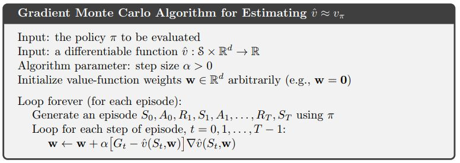
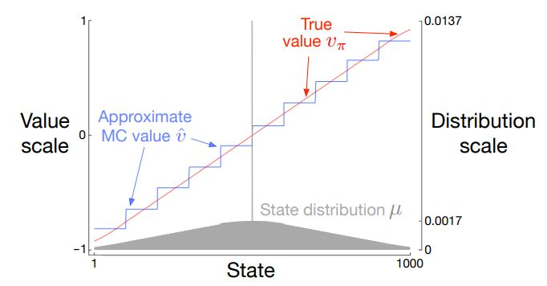
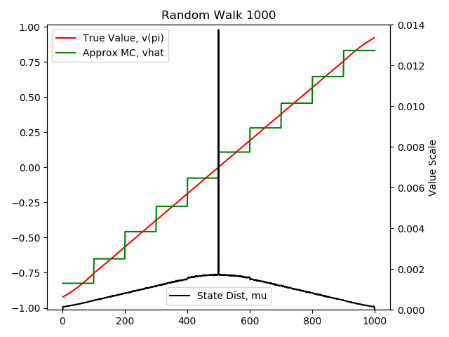
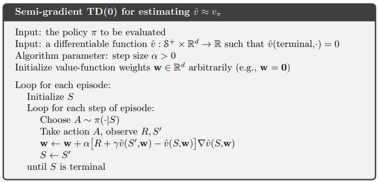
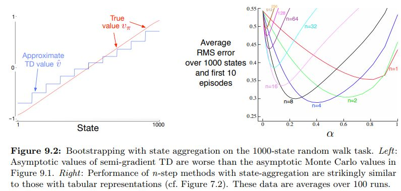
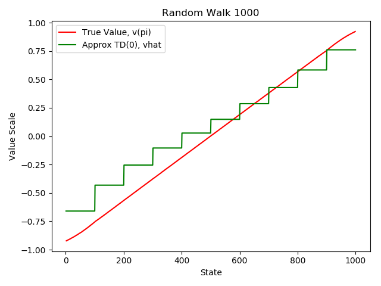
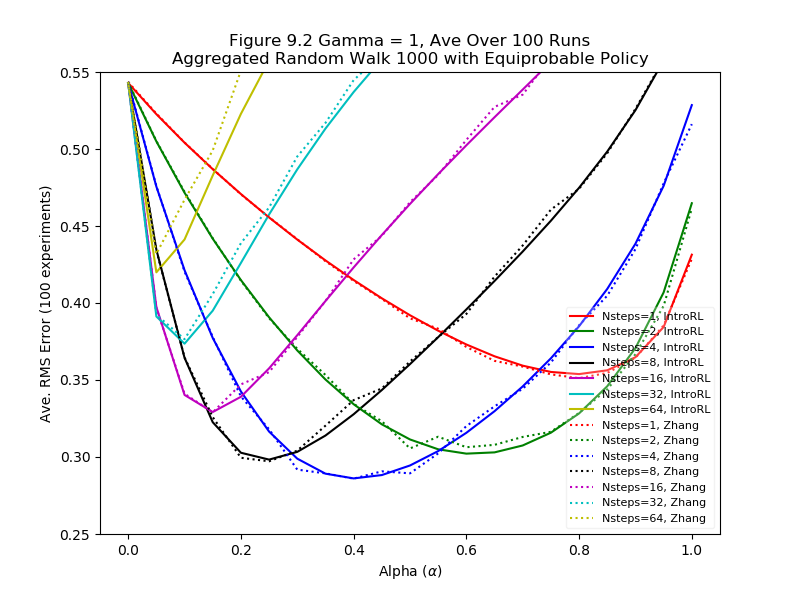

.. chapter_9

Chapter 9 On-Policy Prediction with Approximation
=================================================

This chapter begins function approximation by looking at on-policy prediction.

Given a policy, use function approximation to estimate the state-value function.

Gradient MC Prediction
----------------------

The pseudo code for Monte Carlo prediction is taken from page 202 of
`Sutton & Barto <http://incompleteideas.net/book/the-book-2nd.html>`_ and is shown below.

Figure 9.1
----------

Figure 9.1 on page 204 of `Sutton & Barto <http://incompleteideas.net/book/the-book-2nd.html>`_
uses the above Monte Carlo Prediction on the 1000-state random walk to aggregate the 1000 states
into 10 approximate states.

The left image is taken from `Sutton & Barto <http://incompleteideas.net/book/the-book-2nd.html>`_
and the right image is the result of the **IntroRL** script
`Figure 9.1 Code <./_static/colorized_scripts/examples/chapter_9/plot_randwalk1000.html>`_

Each of the three curves displayed on the **IntroRL** chart are created by a different support script.

`Figure 9.1 True Value <./_static/colorized_scripts/examples/chapter_9/calc_rw1000_trueval.html>`_

`Figure 9.1 MC Approximation Value <./_static/colorized_scripts/examples/chapter_9/mc_rw1000_eval.html>`_

`Figure 9.1 Distribution Scale <./_static/colorized_scripts/examples/chapter_9/calc_mu_rw1000.html>`_

Semi-Gradient TD(0) Prediction
------------------------------

The pseudo code for TD(0) semi-gradient prediction is taken from page 203 of
`Sutton & Barto <http://incompleteideas.net/book/the-book-2nd.html>`_ and is shown below.

Figure 9.2 on page 208 of `Sutton & Barto <http://incompleteideas.net/book/the-book-2nd.html>`_ 
uses the above pseudo code to approximate the aggregated Random Walk 1000 problem.
The figure below is taken from `Sutton & Barto <http://incompleteideas.net/book/the-book-2nd.html>`_ 
and shows both the limit of TD(0) with state aggregation as well as speed of convergence for
n-step semi-gradient TD methods with aggregated linear function approximation.

**IntroRL** was used to recreate both of the above figures.
The code to reproduce the aggregated TD(0) result is 
`Figure 9.2 TD(0) Approximation Value <./_static/colorized_scripts/examples/chapter_9/td0_rw1000_eval.html>`_
The TD(0) code is a minor variation of the Monte Carlo code that was used to make Figure 9.1.

The `Figure 9.2 N-Step Semi-Gradient <./_static/colorized_scripts/examples/chapter_9/plot_9_2_b.html>`_ code
reproduces the n-step results of figure 9.2.  Notice that the results from both **IntroRL** and
`Shangtong Zhang <https://github.com/ShangtongZhang/reinforcement-learning-an-introduction>`_ 
are displayed on the n-step chart.

