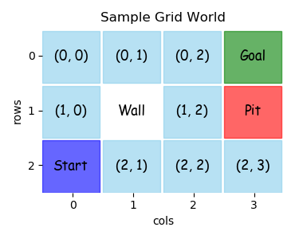
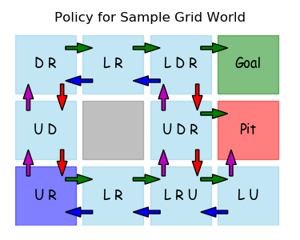
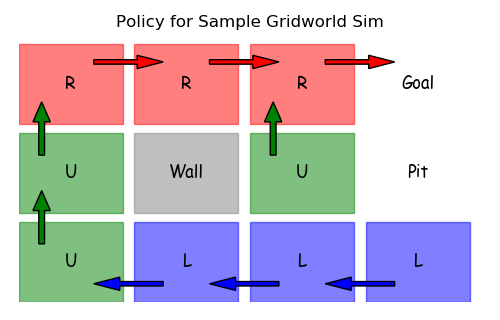

.. overview

IntroRL Overview
================

The goal of **IntroRL** is to generalize the ideas put forth in the textbook
`"Reinforcement Learning An Introduction" <https://www.amazon.com/Reinforcement-Learning-Introduction-Adaptive-Computation/dp/0262039249>`_ 
and to provide a framework for easily applying them to any arbitrary problem.

Models
------

There are two basic types of models in **IntroRL**::

    1) Finite Markov Decision Processes, MDPs (distribution models)
    2) Simulations (sample models)

Each of them can be deterministic or stochastic.

The MDP models are ``distribution models`` because they produce a description of all possibilities
and their probabilities.
The Simulation models are ``sample models`` because they produce just one of the possibilities sampled
in accordance with the probabilities.

Chapter 8 goes into much more detail of the nature of distribution and sample models.

1) MDPs
-------

MDPs are defined in chapter 3 of the textbook, however, the simple definition is that they are models
that fully define all states, actions, rewards and transition probabilities for an environment.

Sample MDP
----------

This section will display the code required to build a simple MDP.
The small gridworld below has the actions Up, Down, Left and Right.
All of those legal actions are defined as shown in the equiprobable policy below.

This section displays the code required to create the MDP that can then be used in
any of the solution approaches from the textbook, Dynamic Programming, Monte Carlo, 
Temporal Difference, etc.

Layout
^^^^^^

The best place to start in building a model is the 2D layout that you want the output to display.
This gridworld, for example, has a layout that can be described by the code below.

Each row of the layout is described by a list of state names.
The python lists, row_1, row_2 and row_3, describe all the states in the 3x4 gridworld.

Each state name should be a hashable, immutable python constant.
For the gridworld, there is a mixture of integer-tuples and string values.

Note that the quoted string ``'"Wall"'``, is a special non-state entry that simply annotates the gridworld.

For both console printed output and matplotlib graphical output, the rows and columns of the layout 
can be given labels as well as a full x_axis and y_axis labels.

.. code-block:: python

    # define layout to create output displays
    row_1 = [ (0,0), (0,1),   (0,2), 'Goal' ]
    row_2 = [ (1,0),'"Wall"', (1,2), 'Pit' ]
    row_3 = [ 'Start', (2,1),   (2,2), (2,3) ]
    s_hash_rowL=[row_1, row_2, row_3]

    # add layout row and column markings (if any)
    row_tickL=[ 0, 1, 2]
    col_tickL=[ 0, 1, 2, 3]
    x_axis_label='cols'
    y_axis_label='rows'

Actions & Rewards
^^^^^^^^^^^^^^^^^

Once the states are defined, the actions and rewards for each state can be set.
The code below uses dictionaries to define all the actions and rewards in the MDP.

These two dictionaries will be used in the main function **get_gridworld** to pass
the action and reward information along to the environment.

For larger MDPs it is more likely to use code to calculate legal actions instead of 
defining them by hand as shown here.

.. code-block:: python

    # one way to define actions is an explicit dict of actions.
    # (can also simply provide logic within a function to define actions)
    actionD = {(0, 0): ('D', 'R'),
               (0, 1): ('L', 'R'),
               (0, 2): ('L', 'D', 'R'),
               (1, 0): ('U', 'D'),
               (1, 2): ('U', 'D', 'R'),
               'Start': ('U', 'R'),
               (2, 1): ('L', 'R'),
               (2, 2): ('L', 'R', 'U'),
               (2, 3): ('L', 'U')  }

    # define rewards
    rewardD = {'Goal': 1, 'Pit': -1}

Next State
^^^^^^^^^^

Although the legal actions for each state are hand-coded above, the next state that those
actions lead to, are not. The function below is used to calculate the next state given
the starting state and actions.

The function **get_next_state** uses the layout definition from above to calculate the next state.

.. code-block:: python

    def get_next_state( s_hash, a_desc ):
        """use layout definition to get next state"""
        
        if s_hash == 'Start':
            s_hash = (2,0)
        row,col = s_hash # all non-terminal s_hash are (row, col)
        if a_desc == 'U':
            row -= 1
        elif a_desc == 'D':
            row += 1
        elif a_desc == 'R':
            col += 1
        elif a_desc == 'L':
            col -= 1
        # no limit checking done... assume only legal moves are submitted
        return s_hash_rowL[row][col]

EnvBaseline
^^^^^^^^^^^

An MDP in **IntroRL** is an instance of an **EnvBaseline** object.
The **EnvBaseline** object can be created in a function factory, or as a directly inherited child object.

To create the simple gridworld, for example, the code below shows the factory approach.

The gridworld would be instantiated by using the two lines of code shown below.

.. code-block:: python

    from introrl.mdp_data.sample_gridworld import get_gridworld
    gridworld = get_gridworld()

Factory Function
^^^^^^^^^^^^^^^^

The factory function **get_gridworld** is shown here.
It uses the constants defined above (s_hash_rowL, row_tickL, x_axis_label, etc.)
as part of the call to EnvBaseline, as well as adding some constants like (colorD
and basic_color) that aid in graphical output of the layout.

The calls to **add_action_dict** and **add_transition** tell the **EnvBaseline** object 
about actions and transitions of the MDP.
When **define_env_states_actions** is called, all the actions, transitions and rewards are known
and the various probabilities are normalized.

Some additional parameters can be set to define a start state, a limited list of start states
and a default policy.

The final statement returns the instance of **EnvBaseline** to the caller.

.. code-block:: python

    def get_gridworld():
        gridworld = EnvBaseline( name='Sample Grid World',s_hash_rowL=s_hash_rowL, 
                                 row_tickL=row_tickL, x_axis_label=x_axis_label, 
                                 col_tickL=col_tickL, y_axis_label=y_axis_label,
                                 colorD={'Goal':'g', 'Pit':'r', 'Start':'b'},
                                 basic_color='skyblue')
                                 
        gridworld.set_info( 'Sample Grid World showing basic MDP creation.' )

        # add actions from each state 
        #   (note: a_prob will be normalized within add_action_dict)
        gridworld.add_action_dict( actionD )
        
        # for each action, define the next state and transition probability 
        # (here we use the layout definition to aid the logic)
        for s_hash, aL in actionD.items():
            for a_desc in aL:
                sn_hash = get_next_state( s_hash, a_desc )
                reward = rewardD.get( sn_hash, 0.0 )
                
                # for deterministic MDP, use t_prob=1.0
                gridworld.add_transition( s_hash, a_desc, sn_hash, 
                                          t_prob=1.0, reward_obj=reward)
        
        # after the "add" commands, send all states and actions to environment
        # (any required normalization is done here as well.)
        gridworld.define_env_states_actions()  

        # If there is a start state, define it here.
        gridworld.start_state_hash = 'Start'
        
        # If a limited number of start states are desired, define them here.
        gridworld.define_limited_start_state_list( [(2,0), (2,2)] )

        # if a default policy is desired, define it as a dict.
        gridworld.default_policyD = {(0, 0):'R',(1, 0):'U',(0, 1):'R',(0, 2):'R',
                                     (1, 2):'U','Start':'U',(2, 2):'U',(2, 1):'R',
                                     (2, 3):'L'}

        return gridworld

`Sample Gridworld, Full Souce Code <./_static/colorized_scripts/mdp_data/sample_gridworld.html>`_

2) Simulations
--------------

Simulations are very similar to MDPs, except that action and transition probabilities are not 
known explicitly, they are implied by observing the simulation's behavior.

Sample Simulation
-----------------

The following sample simulation will also model the same sample gridworld as the above MDP,
except that taking any action only has an 80% chance of moving in the desired direction and
there will be a default reward of -0.04 for every non-terminal step.

Layout
^^^^^^

Just as with an MDP model,
the best place to start in building a simulation is the 2D layout that you want the output to display.

The exact same code can be used here as the MDP above to define the layout.

.. code-block:: python

    # import the parent object... Simulation 
    from introrl.black_box_sims.sim_baseline import Simulation

    # define layout to create output displays
    row_1 = [ (0,0), (0,1),   (0,2), 'Goal' ]
    row_2 = [ (1,0),'"Wall"', (1,2), 'Pit' ]
    row_3 = [ 'Start', (2,1),   (2,2), (2,3) ]
    s_hash_rowL=[row_1, row_2, row_3]

    # add layout row and column markings (if any)
    row_tickL=[ 0, 1, 2]
    col_tickL=[ 0, 1, 2, 3]
    x_axis_label='cols'
    y_axis_label='rows'

Actions & Rewards
^^^^^^^^^^^^^^^^^

As before, once the states are defined, the actions and rewards for each state can be set.

.. code-block:: python

    # one way to define actions is an explicit dict of actions.
    # (can also simply provide logic within a function to define actions)
    actionD = {(0, 0): ('D', 'R'),
               (0, 1): ('L', 'R'),
               (0, 2): ('L', 'D', 'R'),
               (1, 0): ('U', 'D'),
               (1, 2): ('U', 'D', 'R'),
               'Start': ('U', 'R'),
               (2, 1): ('L', 'R'),
               (2, 2): ('L', 'R', 'U'),
               (2, 3): ('L', 'U')  }

    # define rewards
    rewardD = {'Goal': 1, 'Pit': -1}

Class
^^^^^

With the layout defined as above, the top of the class can be implemented.
The step_reward is included as a class parameter in case an instance needs 
to be created with a different value.
The layout parameters are passed to the Simulation.__init__ routine in order
to help the Simulation make ASCII printed, or graphical output.

.. code-block:: python

    class SampleSimulation( Simulation ):
        
        def __init__(self, name='Sample Gridworld Sim',
                     step_reward=-0.04, 
                     random_transition_prob=0.2):
                         
            """A Simulation of a Sample Gridworld"""
            
            self.step_reward = step_reward
            
            # probability of moving in random direction.
            self.random_transition_prob = random_transition_prob
            
            # call parent object
            Simulation.__init__(self, name=name, 
                                s_hash_rowL=s_hash_rowL,
                                row_tickL=row_tickL, 
                                col_tickL=col_tickL, 
                                x_axis_label=x_axis_label, 
                                y_axis_label=y_axis_label)

Two important properties of the Simulation are::

    action_state_set - a set of all states for which there is an action.
    terminal_set     - a set of all states that are terminal.

Two important methods of the Simulation are::

    get_action_snext_reward     - given (state, action) return (next_state, reward)
    get_state_legal_action_list - given (state) return list of legal actions

For this sample gridworld, those can be defined as.

.. code-block:: python

        
        # state hash is
        self.action_state_set = set( actionD.keys() ) # a set of state hashes
    
        self.terminal_set = set( rewardD.keys() )

        # if there is a start state, define it.
        self.start_state_hash = 'Start'

        def get_action_snext_reward(self, s_hash, a_desc):
            """
            Return next state, sn_hash, and reward
            """
            # default is 80% take input a_desc, 20% choose randomly
            if random.random() < self.random_transition_prob:
                a_desc = random.choice( actionD[s_hash] )
        
            # put 'Start' into (row,col) form
            if s_hash == 'Start':
                s_hash = (2,0)
                
            row,col = s_hash # all non-terminal s_hash are (row, col)
            if a_desc == 'U':
                row -= 1
            elif a_desc == 'D':
                row += 1
            elif a_desc == 'R':
                col += 1
            elif a_desc == 'L':
                col -= 1
            # no limit checking done... assume only legal moves are submitted
            sn_hash = s_hash_rowL[row][col]

            reward = rewardD.get(sn_hash, self.step_reward)
            
            return sn_hash, reward
            
        def get_state_legal_action_list(self, s_hash):
            """
            Return a list of possible actions from this state.
            Include any actions thought to be zero probability.
            OR Empty list, if the agent must simply guess.
            """
            
            return actionD.get( s_hash, [] )

`Sample Gridworld Simulation, Full Souce Code <./_static/colorized_scripts/black_box_sims/sample_sim.html>`_
            
Learned Policy
^^^^^^^^^^^^^^

Since the step_reward is -0.04 and the **Pit** reward is -1.0, a learned policy using the simulation
might look like the one below, where avoiding the **Pit** by circling around the Wall is the preferred,
safer route. (see Example 6.6: Cliff Walking)

